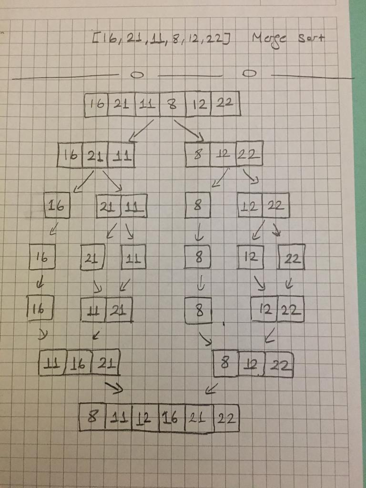

## Merge Sort

[16,21,11,8,12,22] -> Merge Sort

1.Yukarıdaki dizinin sort türüne göre aşamalarını yazınız.

2.Big-O gösterimini yazınız.

-------
Bir listeyi her seferinde parçalara ayırıp tek eleman kalıncaya kadar bölüyor.Böldükten sonra tekrar sıralı bir şekilde bize listeyi veriyor. 

O(nlogn)

